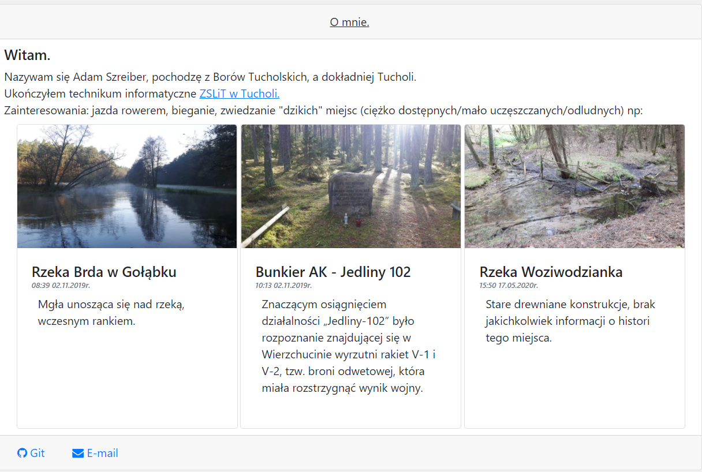
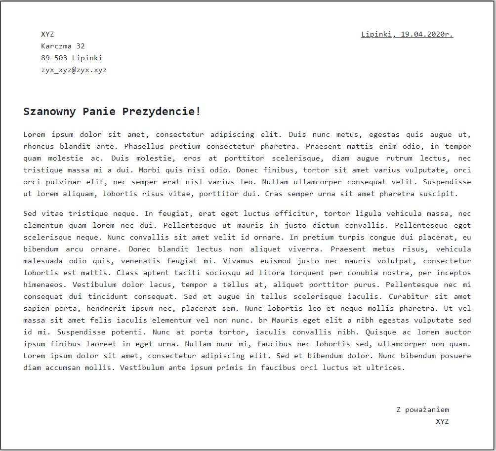
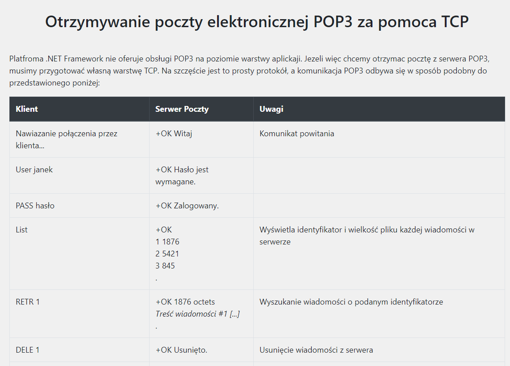
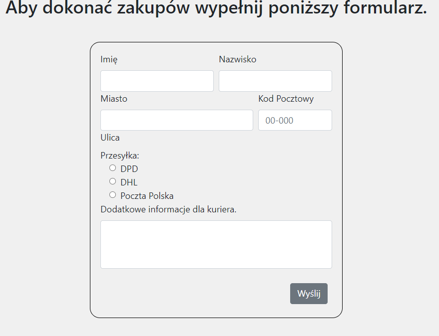

# Przedmiot prowadzony w ramach 5 semestru, studiów I stopnia Informatyka AMW.

## [Lab_1](https://github.com/AdamSzr/projektowanie-serwisow-www-Szreiber-185ic/tree/master/Lab_1)
### Wykorzystane technologie.
* HTML5
* JavaScript
* Bootstrap
* CSS

### Przedstawienie rezultatów.

__Strona główna__ - zawiera krótki opis moje osoby. Jako jedyna posiada plik .js w którym zawarte są elementy stylujące.

__List__ - strona html sformatowana w list. Uważam iż listy powinny być napisane czcionką monospace, w tym przypadku wybrałem [Inconsolata](https://fonts.google.com/specimen/Inconsolata);

__Strona z podręcznika__ ( Book: [ C# 7.0 w pigułce](https://helion.pl/ksiazki/c-7-0-w-pigulce-wydanie-vii-joseph-albahari-ben-albahari,c7pig7.htm#format/d)). 

__Przykładowy formularz__
