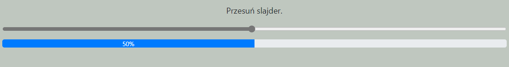
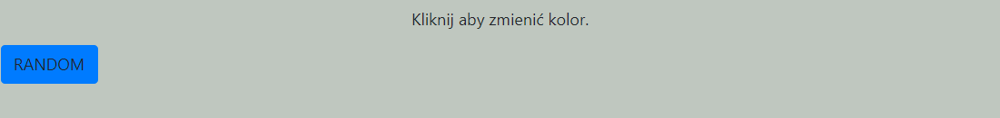
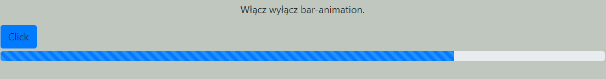
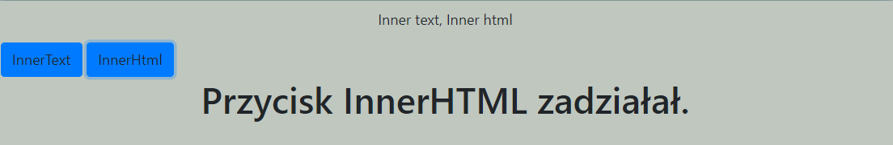
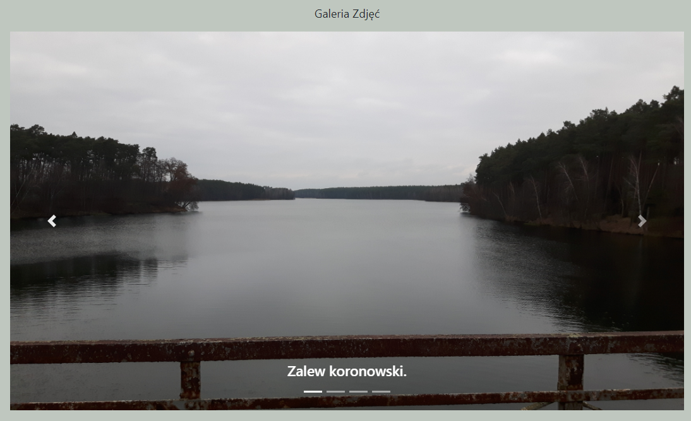

# Lab_2 Praca z elementami DOM + ćwiczenia

## [Lab_2](https://github.com/AdamSzr/projektowanie-serwisow-www-Szreiber-185ic/tree/master/Lab_2)
### Wykorzystane technologie.
* HTML5
* JavaScript
* Bootstrap
* CSS

### Przedstawienie rezultatów.

__Slajder__ - Proste ćwiczenie, w którym pasek_1 służy jako sterowanie dla paska_2, gdy zmienimy wartość paska_1, automatycznie pasek_2 będzie przyjmował tę samą wartość.

__Random Button__ - Przycisk który za każdym kliknięciem zmienia swój bgColor, natomias tekst napisu jest zawsze kolorem PRZECIWNYM do bgColor.

__Animation Bar__ - Obsługa włączania i wyłączania animacji paska.

__Inner html text__ - Przećwiczenie metod inercyjnych.

__Galeria__ - Wykonałem galerię zdjęć z pomocą boostrap'a , oraz js (zmiana img).
