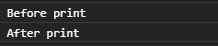
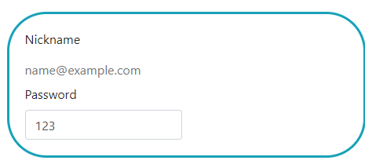
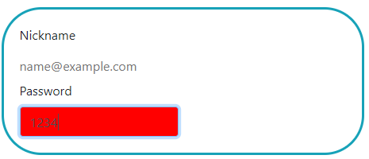
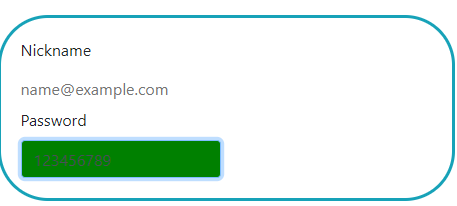
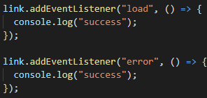
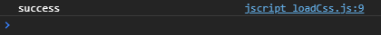
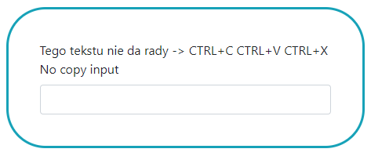
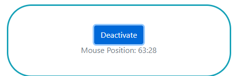

# Lab_3 Obsługa zdarzeń

### Wykorzystane technologie.
* HTML5
* JavaScript

# Część 1

[Link do tresci zadań](https://github.com/kartofelek007/zadania-podstawy/tree/master/3-funkcje/1-zadania)

# Część 2
### Zdarzenia: **beforeprint**  **afterprint**
- wywoływane są w momencie wyzwolenia opcji "Drukuj", oraz po zamkniąciu dialogu.

### Zdarzenia: **input**  **focus** **blur**
* input - wykonuje się za każdym razem gdy użytkownik wprowadzi dane (np.pojedyńczy znak). 
* focus - gdy użytkownik będzie miał możliwość wprowadzania danych (np. w input musi pojawić się migająca kreska).
* blur - przeciwieństwo focus, gdy użytkownik zakonczy wpisywanie, i przejdzie do innego elementu(np. kliknie wyślij).
  
 
W powyższym przykładzie, gdy zaczniemy wpisywać dane w pole "Password" i len(password) < 8, zmieni się bgcolor tego pola na czerwony,
 
w przeciwmyn razie bgcolor będzie zielony.
 

### Zdarzenia: **load**  **error**
W tym przypadku ładuje poprzez element link do css stworzony w JS.
Następnie podpinam go do elementu head.
Gdy operacja przebiegnie pomyślnie uruchamiany jest event 'load', w przeciwnym razie 'error'.

 

### Zdarzenia: **copy**  **paste** **cut** 
Powyższe eventy wykorzystałem aby zbudować ramkę, z której nic nie jestesmy w stanie skopiować, wkleić, czy też wyciąć.
 

### Zdarzenie: **mousemove** **removeEventListener**
Zdarzenie wykorzystałem aby wyswietlić położenie myszy w danym kontenerze.
Dodatkowo zamieściłem przycisk uniemożliwiający dalsze zczytywanie pozycji.

