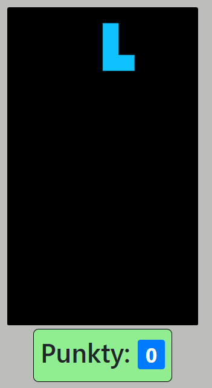

# Lab_4 Gra przeglądarkowa - Tetris

[Link do tresci zadania](https://zacniewski.gitlab.io/teaching/2020-serwisy-www/)

### Wykorzystane technologie.
* HTML5
* JavaScript
* Boostrap

## Sterowanie.
* klawisze 'q' oraz 'w' obrazają puzel.
* klawisze arrow_left, arrow_right, arrow_down - odpowiadają za poruszanie puzla na planszy

## Start gry.
__Gdy gra startuje 1 puzel, pojawia się na samej górze, w połowie szerokości planszy, index(0,area.width/2)__

## Zdobywanie punktów.
__Gdy ułożymy cały wiersz, następuje wycięcie go z tablicy, wypełnienie wartością 0,  a następnie wrzucony na początek planszy, oraz zdobywamy punkty, combo (multi-rows) są dodatkowo punktowane.__  

## Stan gry po zdobyciu punktów.

## Koniec gry.
__Koniec gry następuje w momencie, gdy spawn nowego puzla spowoduje kolizje (za dużo miejsca zajęte na planszy - wysokość budowli)__

__Gdy w wyświetlonym alercie wybierzemy opcję 'OK' gra zaczyna się od nowa.__
