# Lab_5 Asynchroniczny Java Script
 
## [Link do tresci zadania](https://zacniewski.gitlab.io/teaching/2020-serwisy-www/)

### Wykorzystane technologie.
* HTML5
* JavaScript
* Boostrap

### Wstęp.

Na wstępie chciałbym przekazać, iż najtrudniejszą cześcią tej laborki było niesprecyzowanie. 
Wymyślenie tylu przykładów (5 Zadań * 2 podpunkty każde zad * 2 arg w każdym podpunkcie. = 20 api call's)

## Zadanie 1.
##### __funkcja zwrotna (callback)__

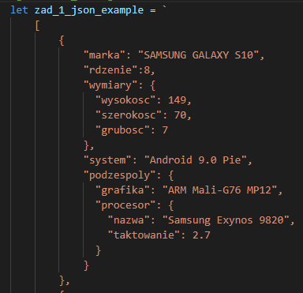

Ryc 1. dane w postaci string json, posiada 2 obiekty (telefony)
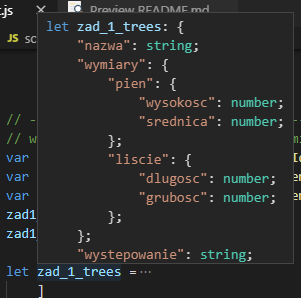

Ryc 2. dane w postaci obiektu json, posiada 2 obiekty (sosnę oraz świerk)
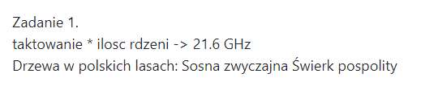

Ryc 3. Wynik pierwszej linii to pobranie z obiektu telefony, ilość rdzeni i przemnożenie przez taktowanie per rdzeń.
Natomiast 2 linia prezentuje, użycie string-template, do którego delegat funkcji. funkcja template string następnie iteruje po niej wywołując index jako argument dla funkcji.
W ten sposób dopóki nie wystąpi exception, pobieram wszystkie nazwy drzew z obiektu json .
 

## Zadanie 2
#### __obiekt Promise (resolve, reject) z metodami then(), catch() i finally() + axios (lub fetch)__
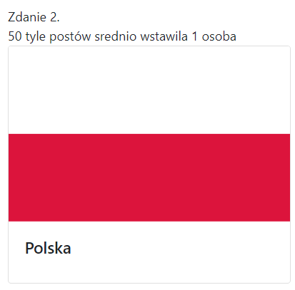

Opis 1 linii. pobieram z api, ilość osób, ilość postów. wyliczamy średnią i wstawiam ww. napis.
Opis ramki. pobieram z api, Url flagi Polski, pobieram z api, napis 'Polska', komponuje w **Boostrap Card** i gotowe.
 

## Zadanie 3

#### __async/await + fetch (lub axios)__
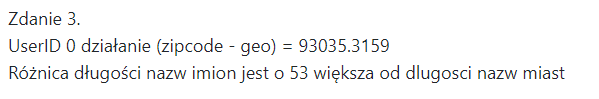

Linia 1. pobieram z api usera, wyciągam od niego zipcode, następnie pobieramy 2 usera, tym razem wyciągam geo lat/lng i parsuje Float.
Komponuję w obiekt div i zamieszczam na stronie.
Linia 2. pobieram z api listę userów, wyciągam od nich imię, oraz miejscowość w której mieszkają,
Sumuje za pomocą **reduce** ilość znaków w imionach, i miejscowościach.
Komponuję kolejnego div'a i zamieszczam na stronie.
 
 

## Zadanie 4

#### __AJAX__

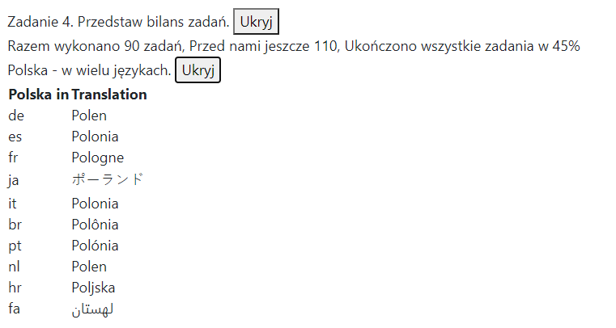

Zatem, to zadanie wykonałem w AJAX, oba przyciski maja subskrypcję eventu click.
button_1 => 
pobiera z api listę wszystkich zadań, iteruje po nich, zliczając ile jest ukończonych a ile nieukończonych.
Wylicza % ukończonych zadań i wstawia do elementu div w pole innerText.
button_2 =>
pobiera z api informację o Polsce, pobieram wartość 'translations' z zwracanego obiektu,
następnie caly słownik 'translations' przekazuję do funkjci która parsuje go do postaci tabeli.
utworzona tabelę prezentuję na stronie.
 

## Zadanie 5

#### __Feach__

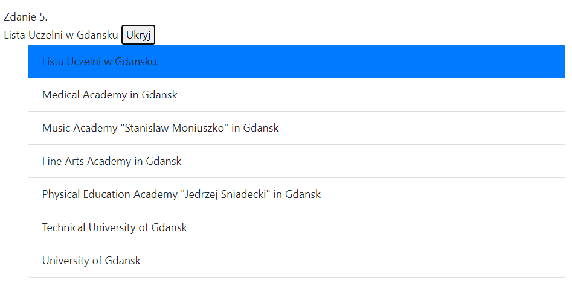

Ryc 1.
 
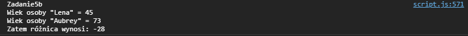

Ryc 2.
 
 
**OPIS**
 
Ryc 1. przedstawia Polskie uczelnie pobrane z api. Następnie parsuje uczelnie pod względem nazwy. (musi zawierać 'Gdansk')
z otrzymanych w ten sposób danych komponuję listę i załączam do strony.
 
Ryc 2. pobieram z api 2 userów, wyciągam od nich imię oraz wiek, następnie przy pomocy stringTemplate i JSON.stringify() prezentuje dane.
 

## Zadanie 6

#### __AXIOS__

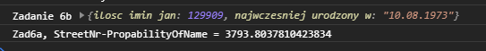
 
Zatem, w 6a, wykonuje call do api aby otrzymać obiekt usera, parsuję go aby otrzymać numer ulicy.
Następnie wykonuje kolejny call do innego api, pytając się o prawdopodobieństwo jakiegoś imienia (tutaj 'jan').
Otrzymuję w ten sposób 2 liczby(int nrUlicy, float prawdopodobieństwo). odejmuję od siebie i prezentuję.
 
6b. pobieram z api randomowego użytkownika, wyciągam od niego datę urodzenia (prasuje z format(rrrr-mm-dd) na format(dd.mm.rrrr) )
wykonuję kolejny api call aby pobrać kolejną wartość, tym razem ilość imion (tutaj 'jan') w bazie danych. 
Prezentuję dane.
 

## Zadanie Dodatkowe

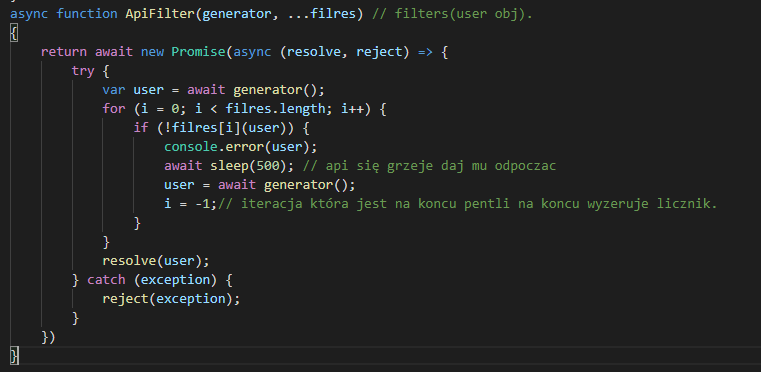
 
Chciałbym również przedstawić funkcję która przyjmuje jako argumenty(generator obiektów , lista filtrów).
Działa następująco. Pobiera 1 obiekt z generatora. Następnie przekazuje obiekt do każdego z filtrów.
Zwracany jest obiekt który przejdzie przez wszystkie filtry pomyślnie.
Gdy któryś z filtrów nie przepuści obiektu, Pobierany jest kolejny a cała sekwencja filtrowania rozpoczyna się od nowa.
 
#### Generator obiektów

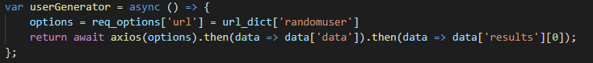
 
#### Kilka domyślnych filtrów.

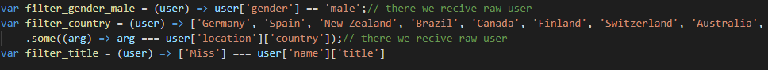
 
### Przykład użycia.

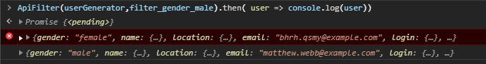

Ryc 1. Osoba o płci męskiej.
 
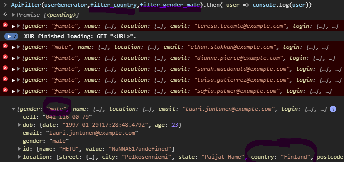

Ryc 2. Osoba o płci męskiej oraz  pochodząca z ['Germany', 'Spain', 'New Zealand', 'Brazil', 'Canada', 'Finland', 'Switzerland', 'Australia', 'United States']
 
 
 
Jak widać po niepomyślnym przefiltrowaniu następuje console.error(user), oraz pobranie nowego RANDOMOWEGO usera.
 
 
 
 

