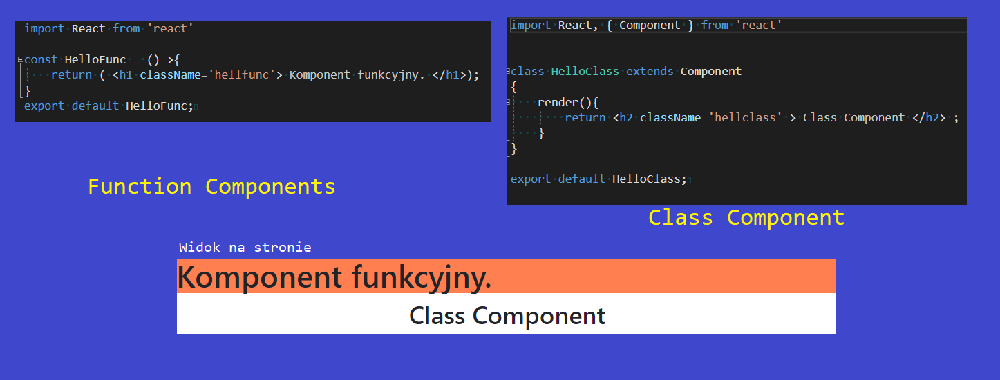
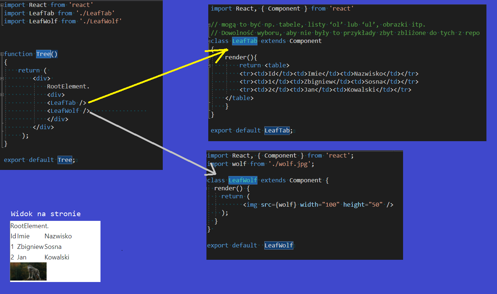
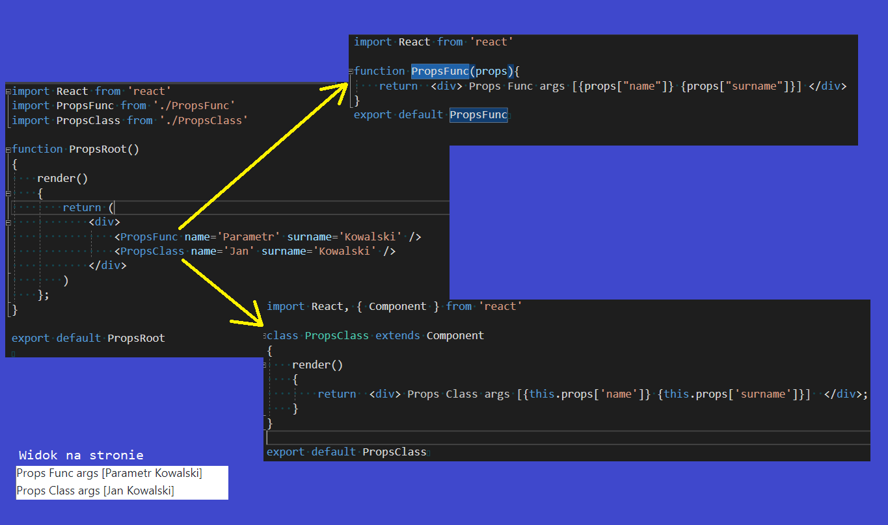
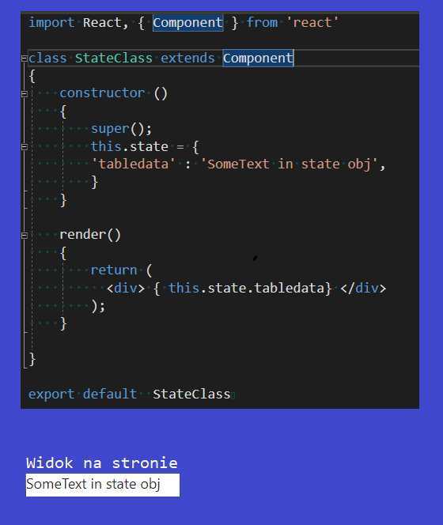
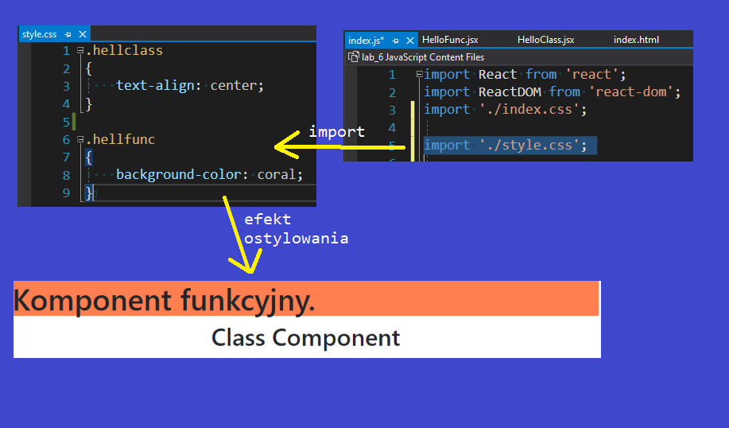
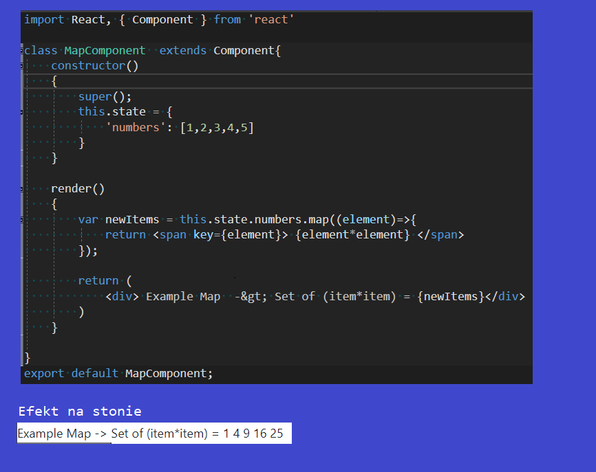
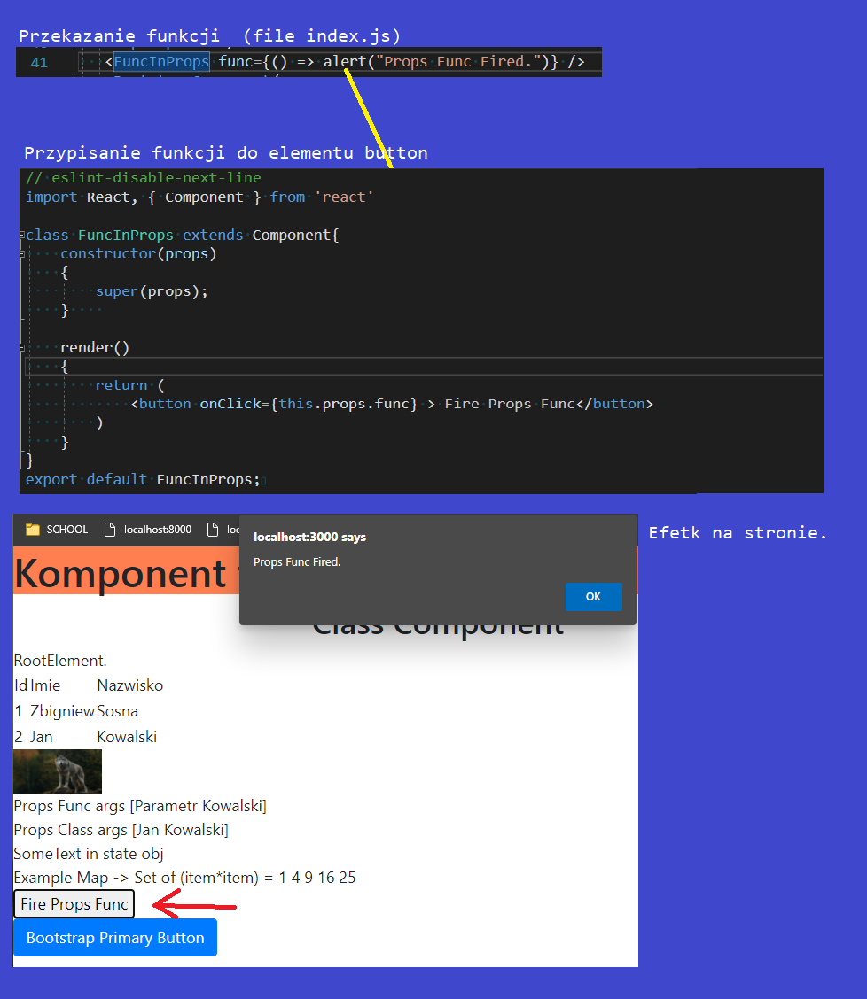
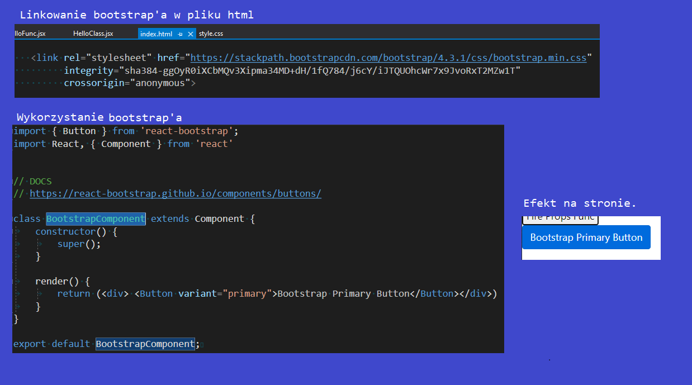
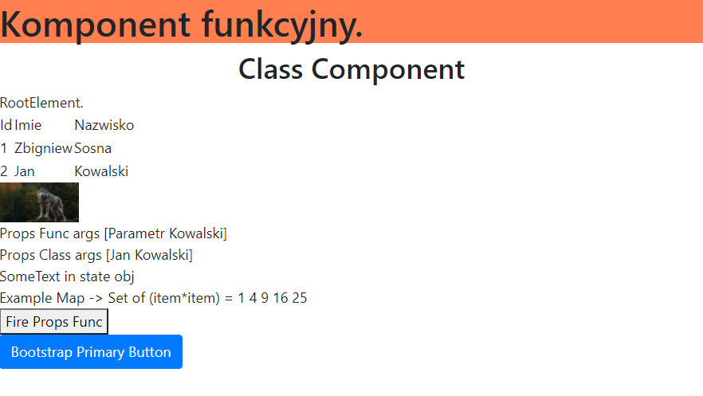
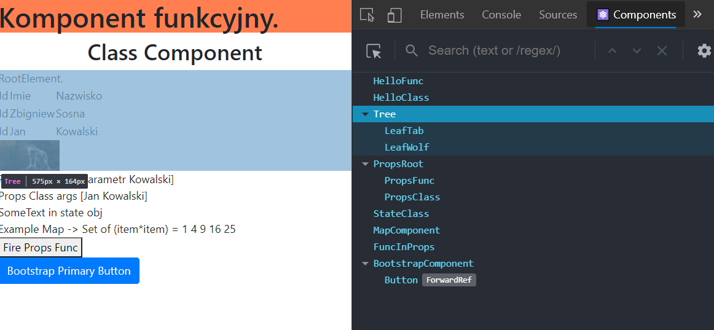

# Lab_5 React - aplikacja nr 1
 
## [Link do tresci zadania](https://zacniewski.gitlab.io/teaching/2020-serwisy-www/)

Dodatkowe informacje.
- Nazwa pliku = Nazwa komponentu + '.jsx'

### 1. tworzenie aplikacji za pomocą modułu ‘create-react-app’, 
### 2. tworzenie komponentów funkcyjnych i klasowych,

### 3. należy utworzyć komponent nadrzędny i dwa komponenty potomne, np. tabele, listy ‘ol’ lub ‘ul’, obrazki itp. 

### 4. należy wykorzystać props (atrybuty, właściwosci) przy przekazywaniu danych do komponentu potomnego,

### 5. należy wykorzystać state (stan) przy tworzeniu komponentu klasowego,

### 6. należy dodać plik .css do wybranych komponentów,

### 7. należy zastosować funkcję map() przy generowaniu komponentów i należy pamiętać o atrybucie key,

### 8. należy zrealizowac wysyłanie funkcji za pomocą ‘props’,

### 9. plusy za wykorzystanie Bootstrapa lub react-bootstrap’a w create-react-app.

#__Osiagnięty rezultat__

#__Widok Z Chrome React Extension__

