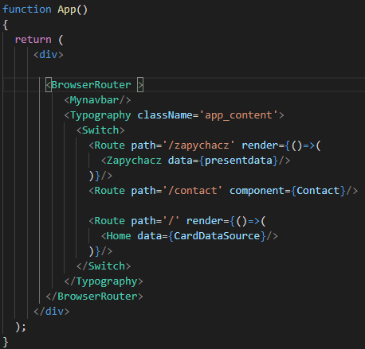
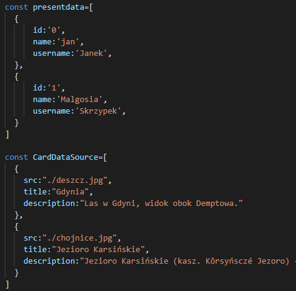
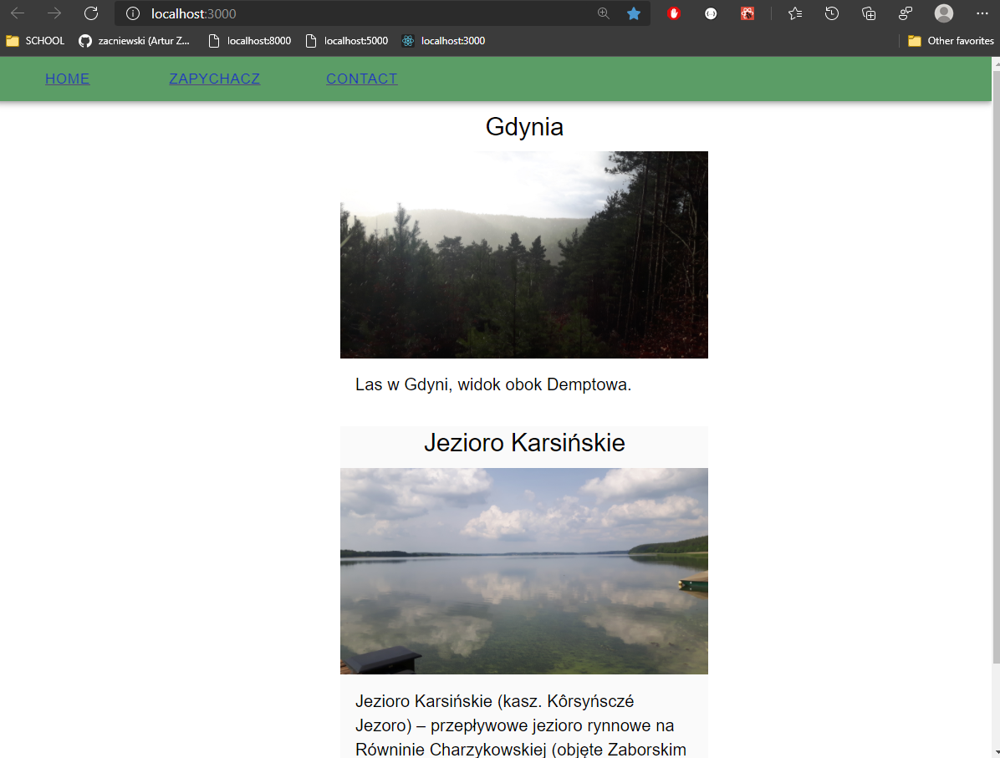
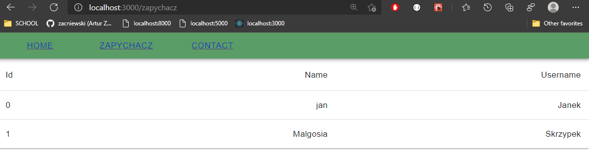
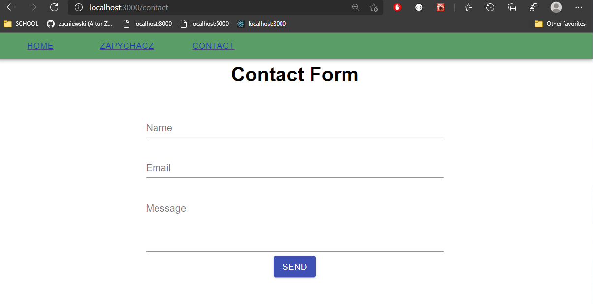

# Lab_7  React - aplikacja nr 2
 
## [Link do tresci zadania](https://zacniewski.gitlab.io/teaching/2020-serwisy-www/)

Dodatkowe informacje.
- Nazwa pliku = Nazwa komponentu + '.jsx'

### 1. należy stworzyć trzy “podstrony” (komponenty link, Switch i Route) 
* Kod poniżej realizuje 3 podstrony ( 1 - "Home", 2 - "Zapychacz", 3 - "Contact")

### 2. na każdej z ww. podstron powinny znaleźć się trzy różne komponenty z Material UI,

Ryc 1. **Home Page** - zawiera komponenty 'Card', 'CardMedia', 'CardActionArea', 'CardMedia'

Ryc 2. **Zapychacz** - Zawiera komponenty 'Table', 'TableRow', 'TableCell', 'TableHead', 'Paper', 'TableBody'

Ryc 3. **Contact Page** - Zawiera komponenty 'FormControl', 'InputLabel', 'Input', 'Button'

### 3. plusy ➕➕➕ za wykorzystanie ‘state’, ‘props’, innych bibliotek (np. bootstrap)

Ryc 4. Dane przygotowane do przekazana, komponentowi 'Dziecku'

Ryc 5. Przekazanie danych do komponentu. 

App.js jest głownym elementem "Korzeniem".

# Osiągnięty efekt.

Ryc 6. Widok - Home - Dane (img src,opis,tytuł) przekazane poprzez Props. 

Ryc 7. Widok - Zapychacz - Dane przekazane przez Props. 

Ryc 8. Widok - Contact. 

