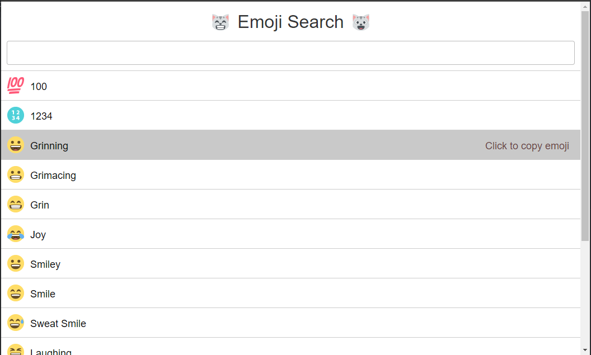
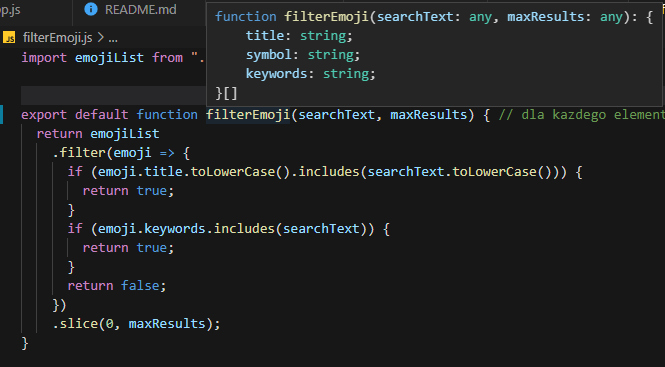
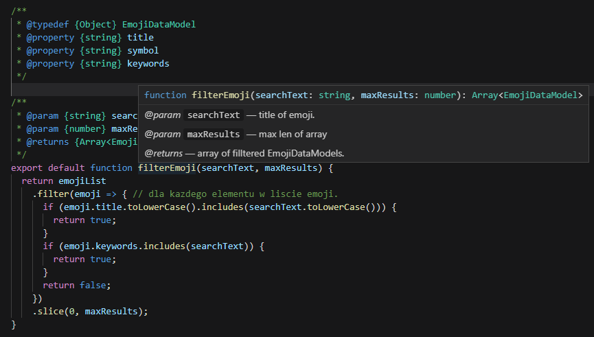
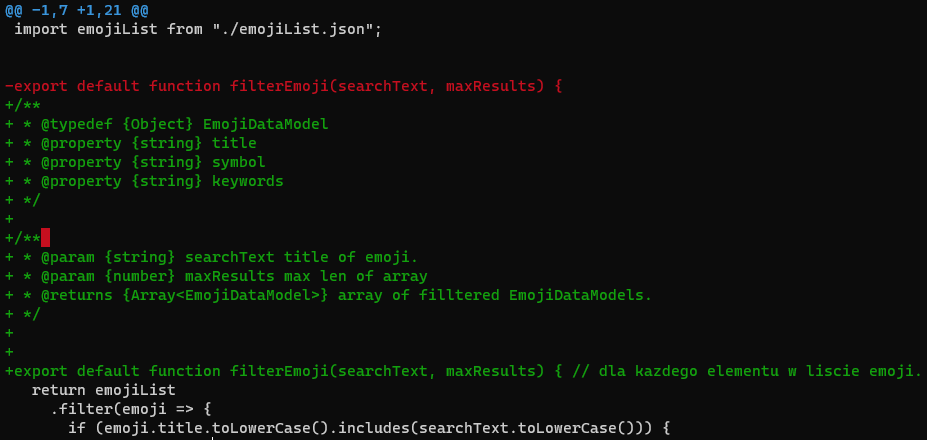
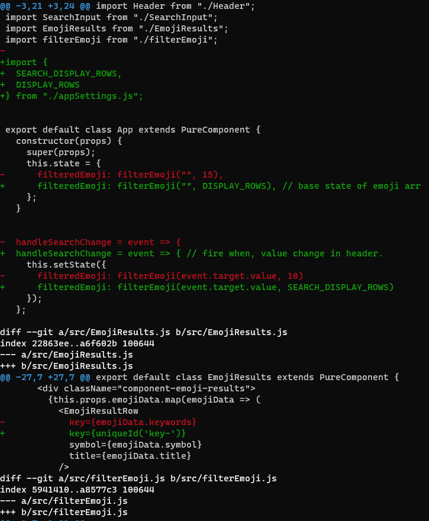

# Lab_8 React - aplikacja nr 2 + analiza kodu źródłowego + git difftool
 
## [Link do tresci zadania](https://zacniewski.gitlab.io/teaching/2020-serwisy-www/)

### Zastosowane moduły:
* [clipboard](https://clipboardjs.com/#example-action)  ➔     Biblioteka ułatwiająca CTRL+C tekstu/obrazów na stronie. 
* [react](https://github.com/facebook/react) ➔ biblioteka stworzona do budowania interfejsów użytkownika.
* [uniqid](https://github.com/adamhalasz/uniqid) ➔ Bilbioteka generujaca unikatowe wartości. Opiera się na aktualnym czasie, procesach i nazwie komputera. 
* [prop-types](https://github.com/facebook/prop-types) ➔ sprawdzanie typów w czasie przekazywania wartości do niżej położonych komponentów. 

# Wygląd aplikacji:

### Wprowadzone zmiany dotyczyły głównie dokumentacji (JSDoc)
- Efekt przed dokumentacją.

- dzięki której informacje po najechaniu na funkcję/klasę/parametr, posiadają pełen opis.

### Widok zmiany JSDoc w gitdiff.

### Dodanie pakietu 'uniqid', w celu generowania unikalnych kluczy listy komponentów.

