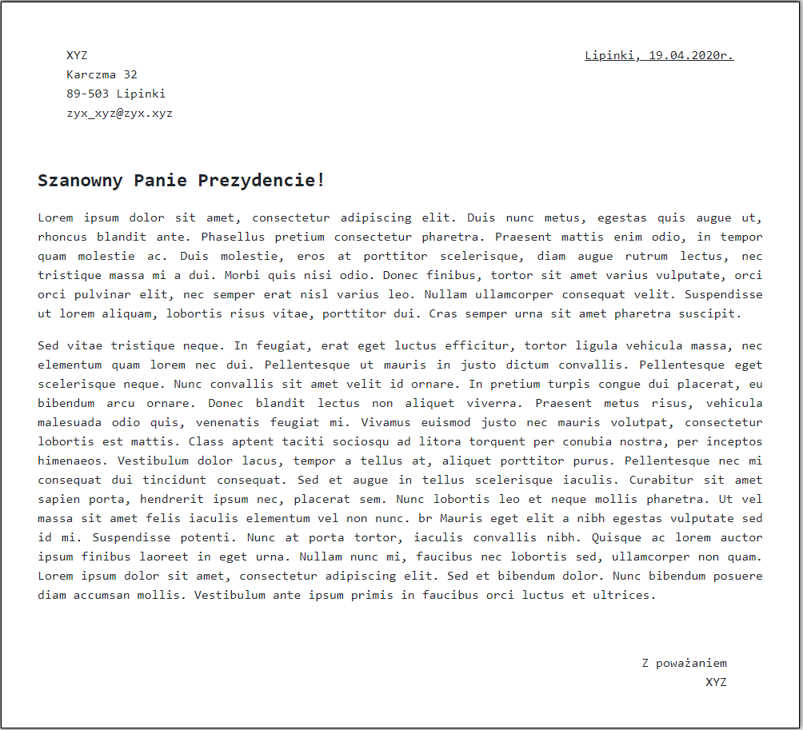

# Przedmiot prowadzony w ramach 5 semestru, studiów I stopnia Informatyka AMW.

## [Lab_1](https://github.com/AdamSzr/projektowanie-serwisow-www-Szreiber-185ic/tree/master/Lab_1)
1. Wykorzystane technologie.
* HTML5
* JavaScript
* Bootstrap
* CSS

### Przedstawienie rezultatów.

Strona główna - zawiera krótki opis moje osoby. Jako jedyna posiada plik .js w którym zawarte są elementy stylujące.

List - strona html sformatowana w list.

Strona z podręcznika. 

Strona z podręcznika. 
